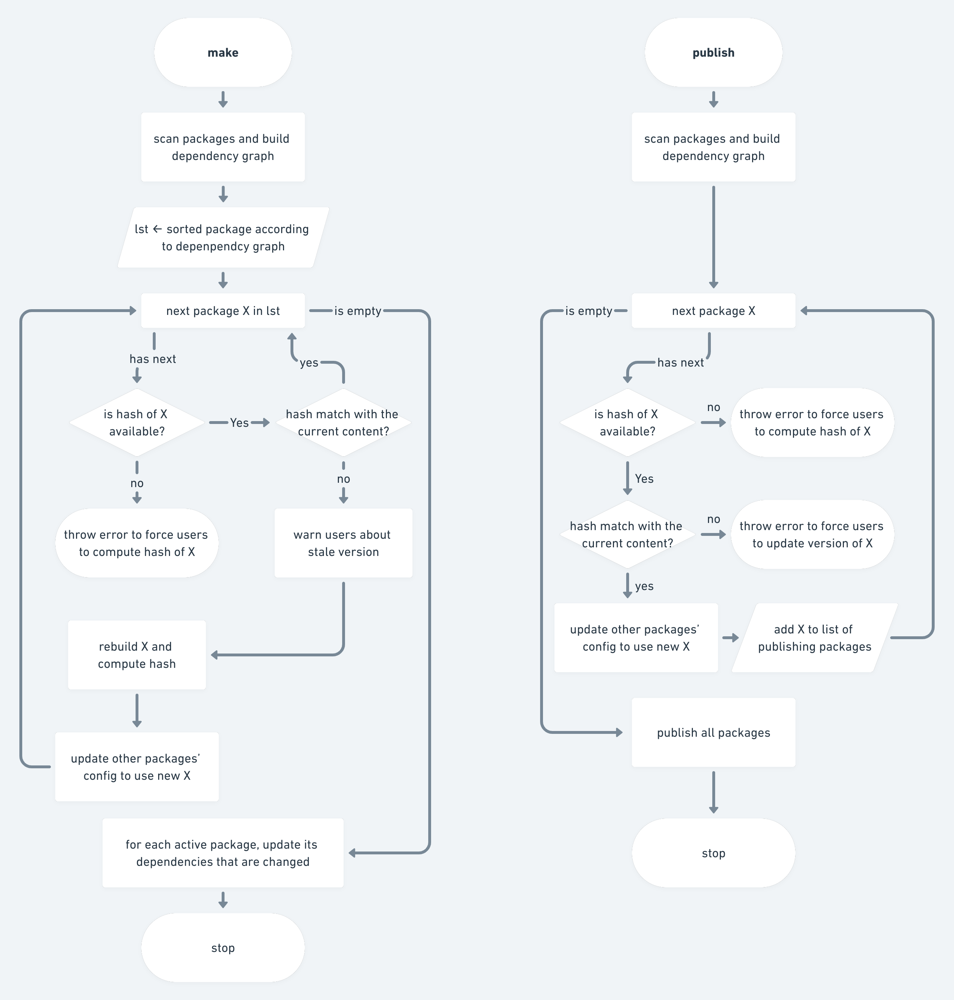

# Introduction

This is a build tool, named `pbt`, for multiple repositories. Specifically, assuming that you have multiple projects/libraries/packages that is organized in different repositories, and each repository is imported to a single repository as submodule to mimic the monorepo approach.

### Project Structure

`pbt` assumes your project is organized in the following structure in which each project has their own project configuration file. A project configuration file tells `pbt` information about the project such as name, version, dependencies and `pbt` will build the project according to the configuration. Currently, `pbt` supports poetry configuration, i.e., it detects the `pyproject.toml` file.

```
<main repo>
    <repo_1>
        ...
        pyproject.toml
    <repo_2>
        pyproject.toml
        ...        
    ...
    pbtconfig.json
```

### Development Workflow

`pbt` provides two main commands: `make` and `publish` for building packages and publishing them to PyPI, respectively. 
<!--
Below are flow charts of `make` and `publish` commands.

-->

During development, you would use the `make` command in the root directory to update all packages: `pbt make`. If you are working on a specific project, you can provide the project so that `pbt` only install packages related to your project: `pbt make -p <your project>`.

After you finish developing and wish to publish, run `pbt publish`. 

Note that if we modify a package and forget to assign it a newer version and the current version is already **submitted** to PyPI, `pbt` will remind you to assign a newer version if you run the `make` command, or will throw error and stop if you run the `publish` command. By this way, `pbt` can stop you from making some changes and forgetting to publish it.

#### `make` command

#### `publish` command

# How does it work

#### How we detect a package
A package is a folder that contains a configuration. A parent package of a package A is the package that use A.

#### State of a package

We are interested in determining if a package has been modified locally, and if a package has been synced with the server. The goal of determining if a package has been modified locally is to know whether we need to rebuild it. While the goal of determining if the current version of a package has been synced with the server is to prevent make some development and forget to create a newer version of it.

To determine if a package is modified locally, we need to compare it with a previous snapshot to see if there are changes.

To determine if the current version of the package locally and the current version of the package remotely is different, ultimately we need to download two packages and compare it content. However, it's possible that even though there is no modification, the content doesn't match that is due to the different line ending across platform (e.g., Windows vs Linux). In this case, we need to detect if it's built on a different platform.
To avoid comparing the content, we can compare it by its hash.

#### `make` workflow

When we run `make`, `pbt` will scan packages to get all current packages. Then, for each package, it determines if the package is modified, and re-build if: it's used by the activate packages and we are not in the editable mode.

Then, for each activate package, we sort its dependencies and install one by one (if in editable mode, then we don't install it if we have been installed before).

#### `publish` workflow

When we run `publish`, `pbt` will scan packages, determine if the content of a package is difference from the current one on pypi, if yes, we publish it. Note that if the version is the same and the content is different, we throw error. 

The state of a package is determined by its version.
The general rule is that if we assign a new version of a package, and hasn't made any changes to the files in the package since then, then it's considered as not modified.
However, since the version is manually inputted and do not have a center db to keep track, it's complicated to determine the correct state of a package. Repeated call should return the same results.

When a package is created for the first time, it's modified.


The general rule is that if we assign a new version of a package, and hasn't made any changes to the files in the package since then, then it's considered as not modified.


A package has three different states: not modified, modified, and not modified but not submitted. The state of a package is determined by its version. Since the version is manually inputted and do not have a center db to keep track, it's complicated to determine the correct state of a package. The general rule is that if we assign a new version of a package, and hasn't made any changes to the files in the package, then it's considered not modified. 

When a package is created for the first time, it's modified. When you


`pbt` detects if a package has been modified by comparing if the commit since the last version is different from the current commit and if there are any files in the package has been modified. Since the config file is part of a package, if the version of any dependency is changed, we consider it is modified. And any modified should be given a newer version. 

Because of this behaviour, if we update the configuration of a package everytime its dependency version is bumped, we also have to update version of a parent package as well. This cascading effect generates lots of extra work. One simple way to avoid this scenario is to disable updating version of the dependency everytime it is updated, and when we install a package, we need to use the '-U' option.

To know if a package is modified, we need to maintain/monitor its state and keep its revision. Hence, for package that is created for the first time, its modified. 

What if the repo is just cloned to a new machine and we didn't have a DB before. How do we know if the package has been modified or not? For that we need to check the package in PyPI; if the dist with the same version does not exist in PyPI; we know the current version in the code must be newer (otherwise, throw error). Since it's not published to PyPI yet; we consider it a newer version and just record the current state. If the dist with the same version does not exist in PyPI; we need to download the file and compare it as we don't know if the file has been modified or not, if the content is different, then it's modified.